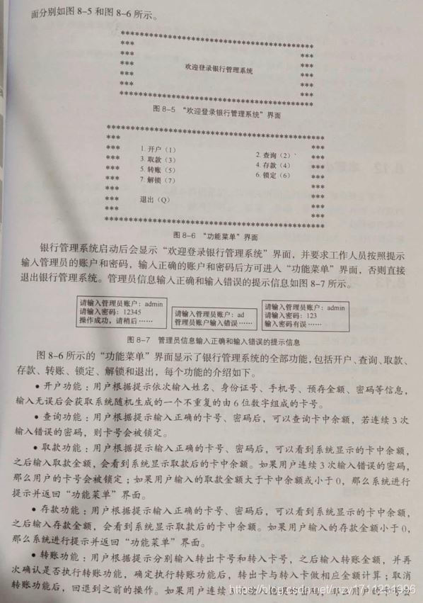

1.阶段案例-银行系统
    银行管理系统是一个集开户、查询、取款、存款、转账、锁定、解锁、退出等一些列业务为一体的管理系统
开户功能：用户根据提示依次输入姓名、身份证号、手机号、预存金额、密码等信息，输入无误后会获取系统随机生成的一个不重复的66位数卡号
查询功能：用户根据提示输入正确的卡号、密码后，可以查询卡中的余额，若连续3次输入错误，卡号会被锁定
取款功能：用户根据输入正确的卡号、密码后，看到系统中展示的余额，之后输入取款金额，会看到系统显示取款后的卡中余额，如果连续3次输入错误的密码卡号被锁
如果用户输入的金额大于卡中的余额 或者小于0，系统提示返回功能菜单
存款功能：根据提示输入正确的卡号、密码，
转账功能：

